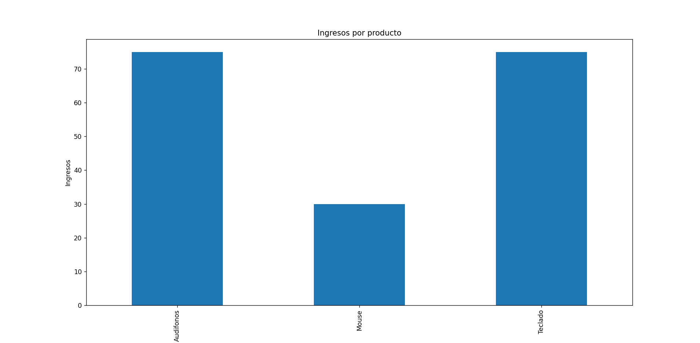

## 🚀 Proyecto de análisis de datos con Python
# 📊 E-commerce Sales Analyzer (Python)

Este proyecto analiza datos de ventas de una tienda online y genera reportes con gráficos para apoyar la toma de decisiones.

## 🚀 Funcionalidades
- Cálculo de ingresos totales
- Identificación del producto más vendido
- Análisis de ventas por producto
- Visualización de datos con gráficos

## 🛠️ Tecnologías usadas
- Python
- Pandas
- Matplotlib

## 📂 Dataset
Archivo CSV con información de ventas:
- fecha
- producto
- cantidad
- precio

## ▶️ Cómo ejecutar

1. Instalar dependencias:
py -m pip install pandas matplotlib

2. Ejecutar el programa:
py main.py

## 📊 Ejemplo de salida

## 🎯 Objetivo del proyecto
Aplicar análisis de datos a un contexto real de e-commerce usando Python.